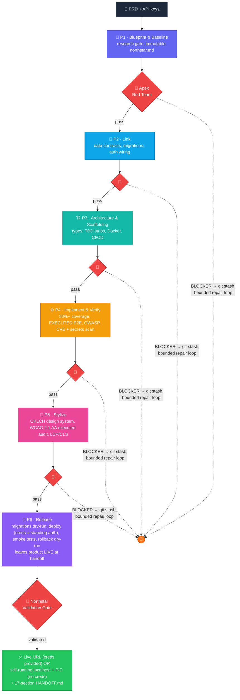
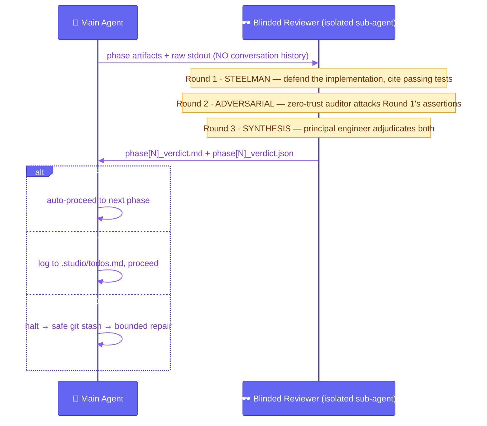
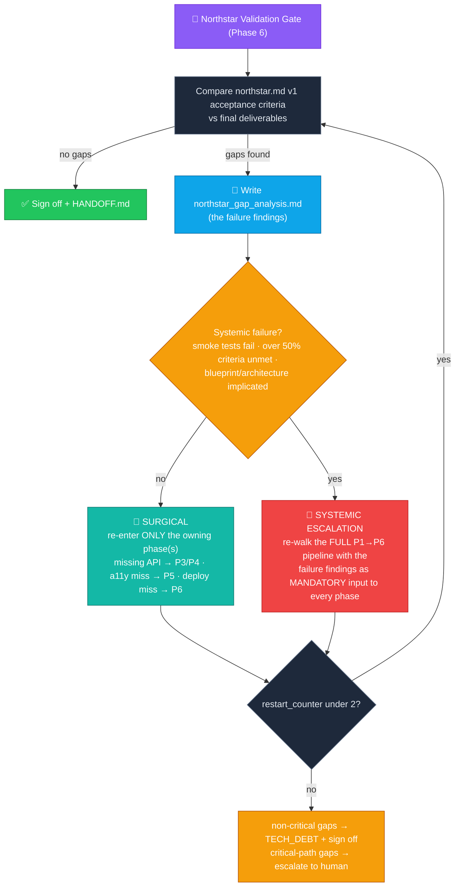

```text
███████╗████████╗██╗   ██╗██████╗ ██╗ ██████╗     ██████╗ ██████╗ ██╗███╗   ███╗███████╗
██╔════╝╚══██╔══╝██║   ██║██╔══██╗██║██╔═══██╗    ██╔══██╗██╔══██╗██║████╗ ████║██╔════╝
███████╗   ██║   ██║   ██║██║  ██║██║██║   ██║    ██████╔╝██████╔╝██║██╔████╔██║█████╗
╚════██║   ██║   ██║   ██║██║  ██║██║██║   ██║    ██╔═══╝ ██╔══██╗██║██║╚██╔╝██║██╔══╝
███████║   ██║   ╚██████╔╝██████╔╝██║╚██████╔╝    ██║     ██║  ██║██║██║ ╚═╝ ██║███████╗
╚══════╝   ╚═╝    ╚═════╝ ╚═════╝ ╚═╝ ╚═════╝     ╚═╝     ╚═╝  ╚═╝╚═╝╚═╝     ╚═╝╚══════╝
```

<div align="center">


**A full production engineering pipeline, packed into a single superprompt.**

  

  

[**⚡ Quickstart**](#-quickstart) · [**🧬 How it works**](#-how-it-works) · [**🎛️ Pick your platform**](#%EF%B8%8F-pick-your-platform) · [**🗺️ Repo map**](#%EF%B8%8F-repo-map) · [**🧪 The science**](#-the-science) · [**❓ FAQ**](#-faq)

</div>

---

## 😴 The Sleep Test

Every prime in this repo is engineered to pass one brutal benchmark:

> **You type `Start Studio Prime`, answer one intake question, hand over a PRD + API keys, and go to sleep. You wake up to a *live* product — a working deployed URL when you handed over hosting credentials, or a fully functional product with its localhost server *still running* (URL + PID documented) when you didn't — not a plausible-looking pile of stubs.**

No stalls. No infinite loops. No silent give-ups. No *"I have completed the implementation"* with predicted-but-never-executed test output. Every claim of success is backed by **proof-of-work**: real terminal output, executed E2E tests, and a live end-state — a deployed URL that survived smoke tests (creds provided), or a still-running localhost server that passed the full smoke suite (no creds). A deployable-but-dark artifact is *not* a passing Sleep Test.

---

## 🧠 What is this?

**Studio Prime** is a suite of **6 superprompts** (5 platform-native + 1 universal) that transform an AI coding agent into a relentless autonomous team of four: **Principal Architect · Senior DevOps Engineer · Master UI/UX Designer · Zero-Trust Red Teamer.**

It is pure prompt engineering — **zero dependencies, zero installs, 100% Markdown.** You copy one file into your agent's system-prompt slot, and that agent now runs a deterministic 6-phase engineering lifecycle with adversarial review gates, bounded repair loops, persistent on-disk memory, and a final requirements audit.

| | Vanilla agent | Studio Prime agent |
|---|---|---|
| "Tests pass" | 🎲 predicted text | 🧾 pasted raw `stdout`, divergence-analyzed |
| Review | 🪞 self-review in same context | 🕶️ blinded 3-round adversarial sub-agent debate |
| Failure | 🔁 infinite retry or give-up | 🧯 5-cycle bounded repair → auto-isolate → continue |
| Memory | 🧠 context window (amnesia) | 💾 `.studio/` state tree, survives crashes & platform hops |
| Done = | "looks done" | 😴 live at handoff (deployed URL *or* still-running localhost + PID) + 17-section `HANDOFF.md` |

---

## ⚡ Quickstart

**1.** Pick your platform and copy its prime into the host's instruction slot:

```bash
# OpenCode                          # Claude Code
cp opencode_prime.md .opencode/system.md       cp claudecode_prime.md CLAUDE.md

# Codex CLI (bump the doc cap first — the prime is ~111 KiB!)
# ~/.codex/config.toml → project_doc_max_bytes = 131072
cp codex_prime.md AGENTS.md

# OpenClaw                          # Antigravity
cp openclaw_prime.md AGENTS.md                 cp antigravity_prime.md AGENTS.md

# Anything else (Cursor, unknown hosts) — the universal prime auto-detects:
cp studio_prime.md <your-host's-system-prompt-slot>
```

**2.** Trigger it:

```text
Start Studio Prime
```

**3.** Answer the one intake question (`NEW PROJECT` or `EXISTING CODEBASE`), hand over your PRD + keys, and walk away. 😴

> Each platform has install Option A (always-on system prompt) and Option B (on-demand skill) — see its [setup guide](#%EF%B8%8F-pick-your-platform).

---

## 🧬 How it works

### The 6-Phase Lifecycle

Every phase boundary is gated by an adversarial review — no human approval needed, no phase skipped:



### The Apex Red Team — blinded adversarial review

The reviewer runs in an **isolated sub-agent context** (or a strictly blinded persona-swap on degraded hosts). It never sees the developer's conversation history, justifications, or compromises — only the PRD, phase artifacts, checklist, and raw `stdout`. The three rounds are **sequential by design**: each round consumes the previous round's output.



### The Northstar Gate — two-tier remediation

Before final sign-off, the agent audits the deliverable against the **immutable** Phase 1 requirements. Gaps don't trigger a dumb restart — they trigger *surgical* remediation, escalating to a *findings-seeded* full pipeline re-walk only when the failure is systemic:



### Proof-of-Work — the anti-hallucination engine

LLMs can't reliably tell *intended* outcomes from *actual* ones. Studio Prime forces the distinction mechanically:

```text
<prediction>        what I expect this command to print
<execution>         the command, actually run via the host shell
<divergence_analysis>  line-by-line: expected vs actual stdout
```

If a success looks indistinguishable from a generic response, the agent injects a deliberately malformed flag into a follow-up run to prove the terminal is actually listening. **Predicted output is never accepted as evidence.**

### Bounded autonomy — the repair loop

```text
failure → 3 direct fix attempts → targeted web research → 1 final retry
        → (max 5 cycles / 20 iterations) → safe git stash → forensic log
        → AUTO-ISOLATE the failing module as [PRIORITY:H] TECH_DEBT
        → CONTINUE the pipeline with remaining scope
        → human invoked ONLY for critical-path dependencies
        → unattended mode: checkpoint-exit non-zero, never block on a human
        → BUT handoff is never a checkpoint: deploy creds = standing
          authorization (exit 0 with a verified live URL); no creds →
          exit 0 with the localhost server LEFT RUNNING (URL + PID logged)
```

---

## 🎛️ Pick your platform

| Platform | Prime | Setup guide | Install target | Sleep Test |
|---|---|---|---|---|
| 🟢 **OpenCode** | [`opencode_prime.md`](opencode_prime.md) | [📖 setup](opencode_setup.md) | `.opencode/system.md` | 🟢 **FULL** |
| 🟣 **Claude Code** | [`claudecode_prime.md`](claudecode_prime.md) | [📖 setup](claudecode_setup.md) | `CLAUDE.md` | 🟡 Partial (manual `/compact`) |
| 🔵 **Codex CLI** | [`codex_prime.md`](codex_prime.md) | [📖 setup](codex_setup.md) | `AGENTS.md` + `project_doc_max_bytes = 131072` | 🟢 **FULL** (`codex exec`) |
| 🟠 **OpenClaw** | [`openclaw_prime.md`](openclaw_prime.md) | [📖 setup](openclaw_setup.md) | `AGENTS.md` | 🟡 Partial (PTY-tethered) |
| 🔴 **Antigravity** | [`antigravity_prime.md`](antigravity_prime.md) | [📖 setup](antigravity_setup.md) | `AGENTS.md` (or `GEMINI.md`) | 🟢 **FULL** (`/goal` + `agy -p`) |
| 🌌 **Universal** (Cursor / unknown) | [`studio_prime.md`](studio_prime.md) | [📖 setup](universal_setup.md) | host's system-prompt slot | 🔍 auto-detected |

**Quick chooser:** want maximum autonomy → **OpenCode** · Claude models + hooks + operator control → **Claude Code** · CI/CD-friendly headless runs → **Codex CLI** · Discord/Slack/multi-channel team triggers → **OpenClaw** · desktop agent cockpit + browser-verified UI work → **Antigravity** · don't know yet / multiple hosts / Cursor → **Universal**.

The universal prime doesn't guess its host — it **physically probes** the toolbelt at session start (shell, sub-agent dispatch, task tool, web tool, structured questions — five variants per slot), builds a capability map, and routes execution through a degradation matrix. No shell? Every artifact gets tagged `[UNVERIFIED - NO SHELL]` rather than silently pretending.

---

## 🗺️ Repo map

```text
studio-prime/
├── README.md                 ← you are here
│
├── studio_prime.md           # 🌌 UNIVERSAL prime — auto-detects all 6 platforms
├── universal_setup.md        #    └─ setup + deep-reference guide
│
├── opencode_prime.md         # 🟢 OpenCode-native prime
├── opencode_setup.md         #    └─ setup guide
├── claudecode_prime.md       # 🟣 Claude-Code-native prime
├── claudecode_setup.md       #    └─ setup guide
├── codex_prime.md            # 🔵 Codex-CLI-native prime
├── codex_setup.md            #    └─ setup guide
├── openclaw_prime.md         # 🟠 OpenClaw-native prime
├── openclaw_setup.md         #    └─ setup guide
├── antigravity_prime.md      # 🔴 Antigravity-native prime
├── antigravity_setup.md      #    └─ setup guide
│
├── CONTRIBUTING.md           # the bar every prime must meet
└── LICENSE                   # MIT
```

And the state tree every prime grows inside **your** project (the cure for LLM amnesia — a session started on one platform can resume on another):

```text
your-project/
├── .studio/                  # 💾 canonical agent memory (cross-platform portable)
│   ├── todos.md              #    task DAG, mirrored to the host TUI where supported
│   ├── blocked.md            #    forensic logs of failed escalations
│   ├── state/                #    northstar.md (immutable), per-phase research, capability map
│   ├── apex_red_team/        #    blinded review verdicts (.md + .json)
│   └── checklists/           #    DAG gate checkpoints
├── architecture/             # 🏛️ decisions.md, data_contracts.md, phase_snapshots/
├── design-system/MASTER.md   # 🎨 canonical OKLCH tokens, typography, banned patterns
└── HANDOFF.md                # 📦 17-section final handoff (placeholder-free, gate-verified)
```

---

## 🛡️ What "production-grade" actually gates

<details>
<summary><b>Expand the proof-of-work checklist</b> — every item is a binary, executed gate, not a prose claim</summary>

<br/>

| Domain | Gate |
|---|---|
| 🧪 Testing | 80%+ business-logic coverage (**BLOCKER below**), executed E2E/integration on critical journeys — stubs are a BLOCKER |
| 🔐 Security | OWASP hardening, dependency CVE audit, secrets-leak scan, schema validation, rate limiting, HttpOnly/Secure/SameSite cookies |
| 🐳 Ops | Multi-stage Docker, CI/CD pipeline, reproducible DB migrations (dry-run gated), JSON stdout logging (parser-validated), health probes |
| 📉 Resilience | Graceful `SIGTERM` drain (≤35s, tested), synthetic-error → alert-propagation check, timed rollback dry-run (<5 min), smoke tests with autonomous rollback on 5xx |
| ♿ Accessibility | WCAG 2.1 AA via an **executed** runtime audit (pa11y / axe-core against the running app) — audit-only or stub-only submissions are a BLOCKER |
| 🎨 Design | OKLCH color space, full component state matrices (default/hover/focus/active/disabled), spring/physics-based motion (no generic bounce), no `#000000`, no AI-starter-pack slop |
| 📦 Handoff | 17-section `HANDOFF.md`, authored as `## N.` headings, gate-counted and placeholder-scanned before sign-off |
| 🟢 Liveness | At sign-off the product is LIVE — the deployed URL (creds provided) or `http://localhost:<port>` + PID (no creds) returned **HTTP 200** on a re-probe, with the `curl` stdout captured as proof-of-work; deployable-but-dark is a BLOCKER |

</details>

<details>
<summary><b>Safety model</b> — what always requires a human</summary>

<br/>

The human is a **blocking API**, invoked only when genuinely needed:

1. **Destructive & network gates** — `rm -rf`, `npm publish`, DB drops, force-push, `chmod 777`, piping `curl` to shells, port scanners: always human-authorized. Studio Prime **never** autonomously hard-resets. (A deploy to the *user-supplied* target with *user-supplied* credentials is not "destructive" for this rule — it's pre-authorized; see bullet 2.)
2. **Credential gaps** — keys/tokens the agent can't self-provision. The flip side is **credentials-as-authorization**: hosting/deploy credentials supplied at intake (`VERCEL_TOKEN`, `NETLIFY_AUTH_TOKEN`, `FLY_API_TOKEN`, a logged-in CLI, kubeconfig, SSH deploy key…) *are* the deploy authorization — their presence licenses an autonomous live deploy, in interactive **and** unattended mode. Only their **absence** is a gap, and even then the agent ships a still-running localhost server rather than stalling.
3. **PRD conflicts** — two requirements pointing at materially different products: halt and ask, never guess.
4. **Architecture / research overrides** — an architecture or research gate that requires explicit human authorization to proceed. (Deployment is **not** in this list: when deploy credentials were provided, going live is pre-authorized; when they were not, the agent leaves a running localhost server instead of asking.)
5. **Critical-path repair exhaustion** — after the bounded repair loop, only critical-path module failures escalate; everything else is isolated and the pipeline continues.

</details>

---

## 🧪 The science

These mechanics aren't vibes — they're implementations of peer-reviewed agent research:

- **Multi-agent debate** → *ChatEval* (Chen et al., 2023): isolated adversarial roles beat single-agent self-critique at catching hallucinations. → the **Apex Red Team**.
- **Verbal reinforcement** → *Reflexion* (Shinn et al., 2023): converting raw environment feedback into linguistic self-reflection breaks failure loops. → **`<divergence_analysis>`**.
- **LLM-as-OS memory** → *MemGPT* (Packer et al., 2023): paging state to a persistent filesystem defeats "lost in the middle" degradation. → **the `.studio/` tree**.

---

## ❓ FAQ

<details>
<summary><b>Is this a framework? Do I need to install anything?</b></summary>
<br/>
No. It's 100% Markdown. There is no SDK, no npm package, no runtime. You copy one file into your agent's instruction slot. The "runtime" is your existing AI coding agent — the prime reprograms how it behaves.
</details>

<details>
<summary><b>Which file do I actually use?</b></summary>
<br/>
One prime per project. If your host is one of the five named platforms, use its native prime (sharper tool bindings). If you're on Cursor, an unknown host, or hopping between hosts, use <code>studio_prime.md</code> — it probes and adapts.
</details>

<details>
<summary><b>What models does it work with?</b></summary>
<br/>
Model-agnostic by design. The primes constrain <i>behavior</i> (gates, verification, state) rather than relying on model-specific quirks. Stronger models go further unattended, but the proof-of-work gates keep weaker models honest too.
</details>

<details>
<summary><b>Will it really run unattended?</b></summary>
<br/>
On OpenCode, Codex CLI (<code>codex exec --sandbox workspace-write -a never</code>), and Antigravity (Agent-driven autonomy + <code>/goal</code> + headless <code>agy -p</code>) — yes, that's the Sleep Test, and the Autonomous Execution Contract in every prime exists to guarantee it. Claude Code and OpenClaw run partially attended (manual <code>/compact</code> / PTY tether). The handoff itself is never a checkpoint: if you supplied hosting credentials, the agent deploys live and hands you a working URL; if you didn't, it leaves a localhost server running (URL + PID documented) so you wake to a working product either way. Truly destructive, irreversible operations (data drops, force-push) always stop for a human, no matter the mode — but an authorized deploy with your own credentials is not one of them.
</details>

---

<div align="center">

## ⭐

**If Studio Prime shipped something while you slept, consider starring the repo.**

[MIT License](LICENSE) · [Contributing](CONTRIBUTING.md)

*Architected by **Suraj Kuncham**. Designed to push the boundaries of autonomous software engineering.*

`while (you.sleep()) { studio.ship(); }`

</div>


